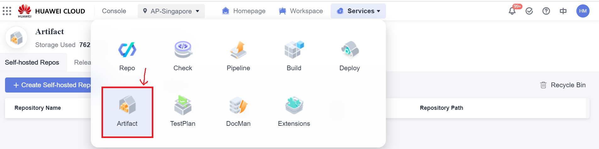
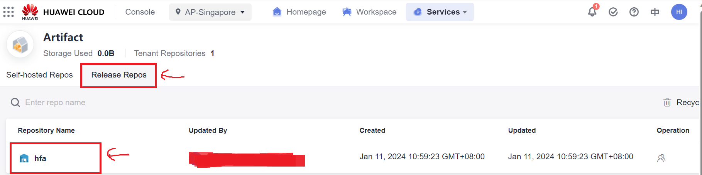
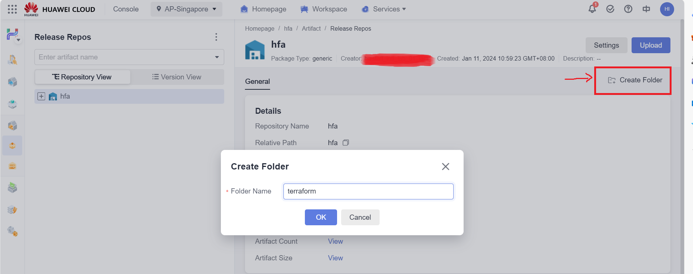
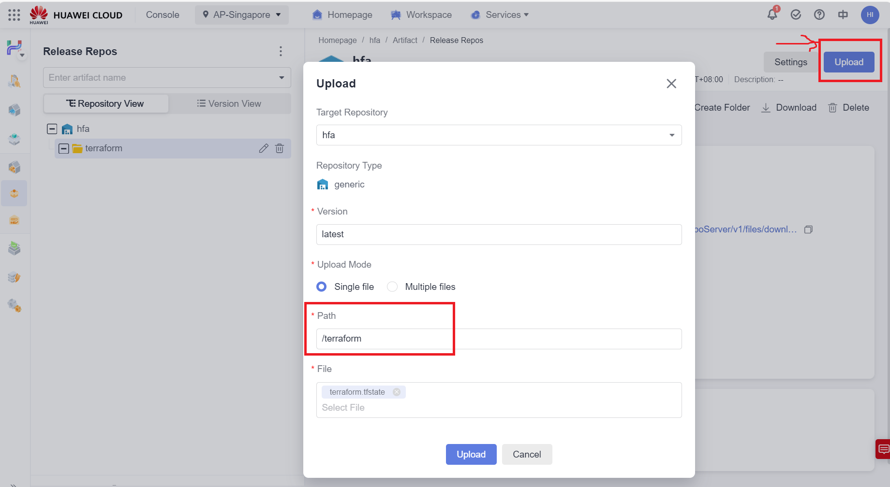

# hfa-vpc-provisioning-environment
This Terraform configuration aims at provisioning Terraform execution environment within a VPC and use PostgreSQL as the backend to provide state-lock capability

## Introduction 
It's reasonable for migrating the Terraform state for this configuration to the backend that wil be created by this configuration after the successful execution of this configuration. 

This configuration uses local backend by default for simplicity, it can be changed to whatever backends available for your environment.

## Getting Started

### Create Artifact Repo
1. Go to `CodeArts` console and Choose `Artifact` service in your project

2. Choose the default repo for your project

3. Create a folder under the repo for stroring Terraform state

4. Upload the empty `terraform.tfstate` file in this repo to the Artifact repo, the purpose of this is to keep CodeArts build job going when it's first executed

### Create CodeArts Build Job
### Create CodeArts Pipeline