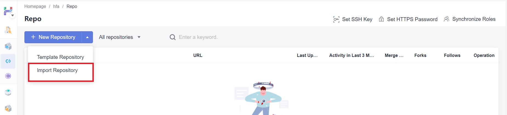
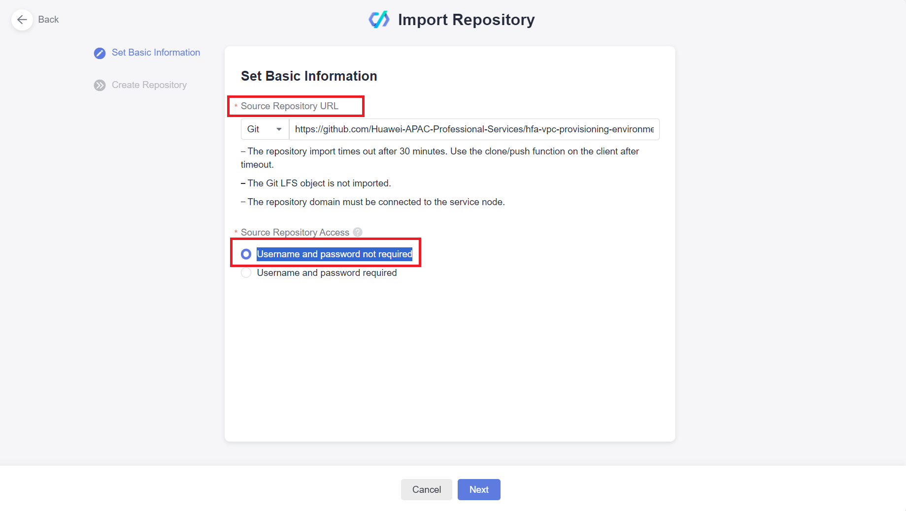
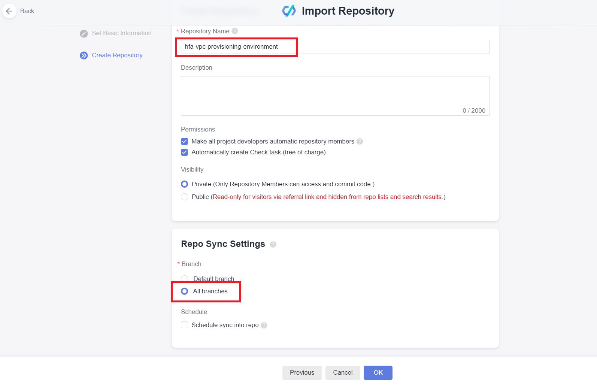
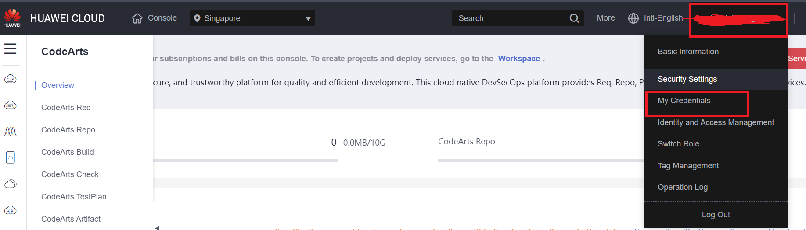
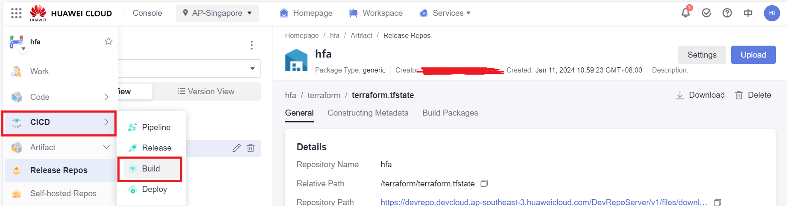
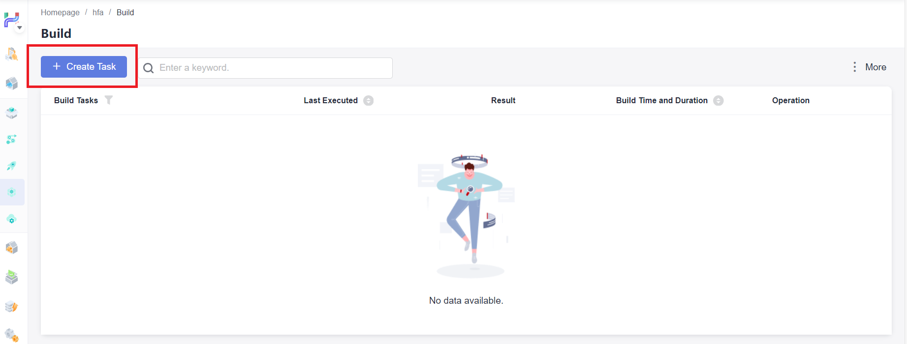
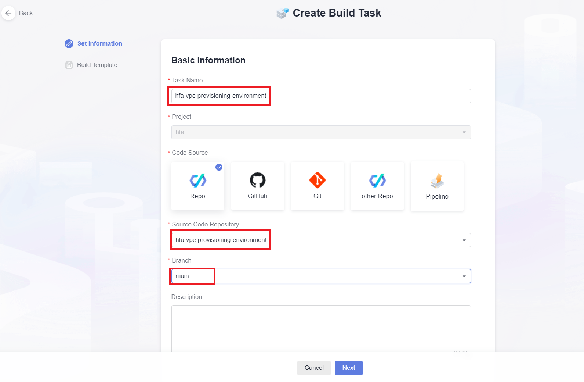
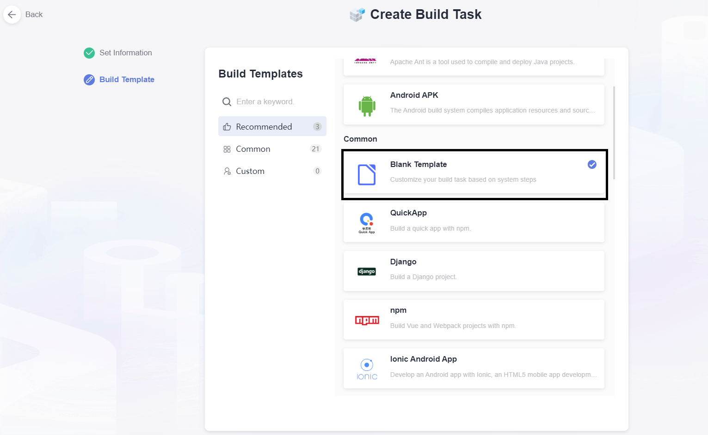

# hfa-vpc-provisioning-environment
This Terraform configuration aims at provisioning Terraform execution environment within a VPC and use PostgreSQL as the backend to provide state-lock capability

## Introduction 
It's reasonable for migrating the Terraform state for this configuration to the backend that wil be created by this configuration after the successful execution of this configuration. 

This configuration uses local backend by default for simplicity, it can be changed to whatever backends available for your environment.

## Getting Started

### Create Artifact Repo
1. Go to `CodeArts` console and Choose `Artifact` service in your project

2. Choose the default repo for your project

3. Create a folder under the repo for stroring Terraform state

4. Upload the empty `terraform.tfstate` file in this repo to the Artifact repo, the purpose of this is to keep CodeArts build job going when it's first executed

### Clone Code Repository to CodeArts
1. On the left side pannel of CodeArts console, Choose `Code` --> `Repo`
 

2. On the `Repo` console, Choose `+ New Repository` menu and Click `Import Repository` to import a repository from Github

3. On the Code Repo Creation page, provide `https://github.com/Huawei-APAC-Professional-Services/hfa-vpc-provisioning-environment.git` as source and check `Username and password not required` option
 

4. On the next page, only change `Repo Sync Settings` to `All branches` and leave other parameters to default

### Create Credentials for creating CodeArts agent
1. Log in to Huawei Cloud Console, Click username on the top right corner of the console and Select `My Credentials`

2. 
### Create CodeArts Build Job
1. On the left side pannel of CodeArts console, Choose `CICD` --> `Build`

2. On the `CodeArts Build` Console, Click `+ Create Task` button

3.  On the `Create Build Task` page, select the imported repo as the `Code Source`

4. Choose `Blank Template` as the `Build Template`
 

5. 
### Create CodeArts Pipeline